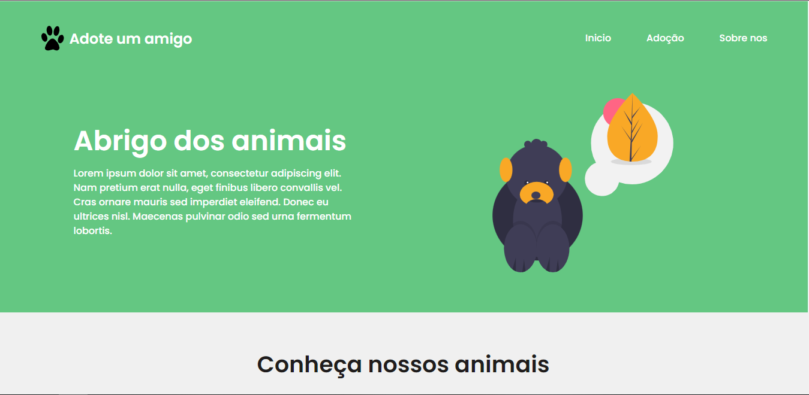

<h1 align="center">
   Pagina inicial Adote um Amigo
</h1>

<h4 align="center">
  Criado com o intuito de aprimorar meus conhecimentos nas tecnologias HTML, CSS e JS.
</h4>

## 📚 Seções
Projeto de um site de adoção de animais, o projeto é composto por 4 paginas:

- **Pagina inicial:** Contendo informações basicas sobre o funcionamento do site e apresentação dos animais;
- **Perfil do animal:** Pagina contendo descrição do animal selecionado e imagens do mesmo;
- **Formulario de adoção:** Formulario de declaração de intenção a adoção ;
- **Sobre nos:** Pagina contendo informações, redes sociais e localizão sobre o projeto;

---

## 💼 Tecnologias utilizadas
Para o desenvolvimento deste projeto utilizei as seguintes tecnologias:

- HTML;
- CSS;
---

#### Autor
Willian Stephano